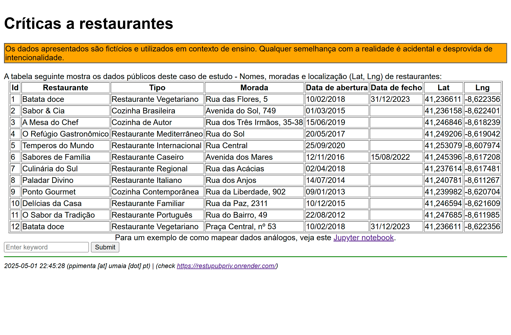
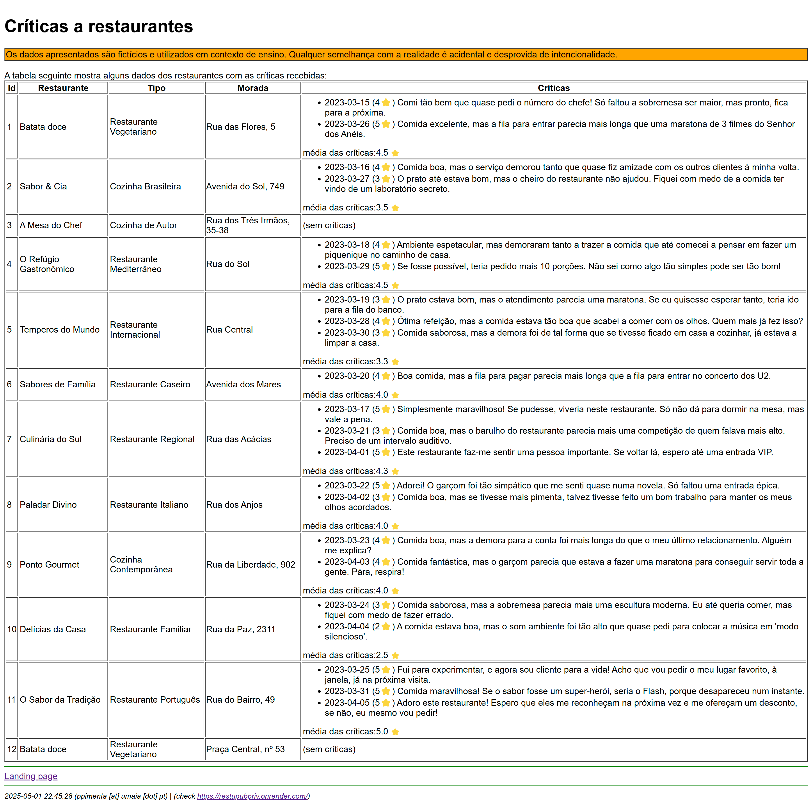

# RestUPrivPub

## Purpose
Demonstrate how to use a shared spreadsheet as a lightweight backend, and build a frontend interface that dynamically displays public, private, or combined data based on a given keyword.

## 🎯 Objectives

- **Use Google Sheets** (or any system with accessible REST APIs) **as a backend database**
- **Build a Flask/HTML/JS frontend** to display filtered data
- **Implement access control logic** based on keywords  
  _(not traditional user/password/roles)_
- **Ensure real-time or on-demand sync**  
  Reflect spreadsheet updates in the frontend as data changes
- **Promote reusability and simplicity**
  - Showcase how non-traditional backends like spreadsheets can support simple, shareable apps
  - Encourage students to reuse the setup for lightweight, data-driven projects

## Implementation
Data is edited in a google sheet - [Críticas-Restaurantes googlesheet](https://docs.google.com/spreadsheets/d/169a3ZNxygZSub9qWiAHeCG1QPu7XO37xH8-ubm54a0k/edit?usp=sharing). (Google) 'users' can share editing responsabilities.

The code for a flask application is maintained in this repository [https://github.com/pedroccpimenta/RestUPubPriv @ github](https://github.com/pedroccpimenta/RestUPubPriv), and deployed through [render](render.com) at [https://restupubpriv.onrender.com/](https://restupubpriv.onrender.com/)

PP, May 1st, 2025